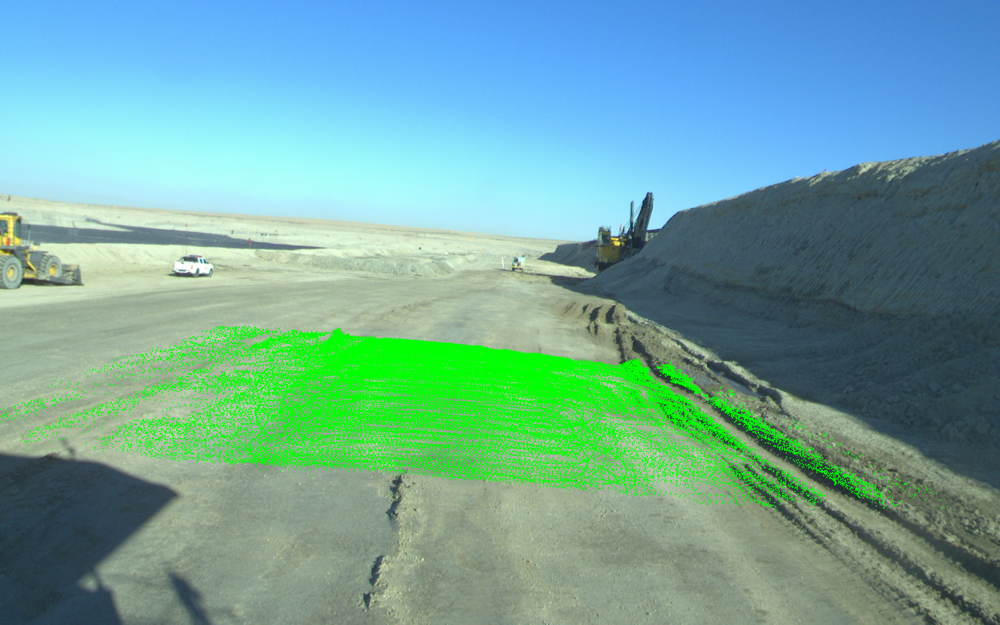

<div align="center">

# Uni3DScenes

</div>

### [Paper](https://arxiv.org/abs/2303.09551) | [Data](https://cloud.tsinghua.edu.cn/d/8dcb547238144d08a0bb/)

> Scene as Occupancy and Reconstruction: A Comprehensive Dataset for Unstructured Scene Understanding

> [Author\*](https://weiyithu.github.io/),[Author](https://weiyithu.github.io/),[Author](https://weiyithu.github.io/),[Author](https://weiyithu.github.io/),[Author](https://weiyithu.github.io/),

<div
align=center>

</div>

## News

- [2023/11/20]: Initial code, dataset, and paper release.

## Abstract

It is a perception dataset for unstructured scenes, characterized by 3D semantic occupancy prediction and road surface elevation reconstruction tasks. The dataset provides detailed annotations for 3D semantic occupancy prediction and road surface elevation reconstruction, offering a comprehensive representation of unstructured scenes. In addition, trajectory and speed planning information is provided to explore the relationship between perception and planning in unstructured scenes. Natural language descriptions of scenes are also provided to explore the interpretability of autonomous driving decision-making. The collected scenes cover various irregular obstacles, including muddiness, elevations, and depressions. It may contribute to both research and applications in terms:

(i) We constructed the world’s first comprehensive perception dataset for unstructured scenes, which focuses on irregular obstacles and road surface undulations. The tasks of 3D semantic occupancy prediction and road surface elevation reconstruction were defined to effectively represent and understand unstructured scenes.

(ii) Depth estimation labels were provided for monocular vision tasks. Annotations for path planning and natural language scene descriptions were also provided, which are used for future exploration of end-to-end (E2E) autonomous driving and vision-language models (VLMs) in unstructured scenes.

(iii) Experiments were conducted with the state-of-the-art (SOTA) methods to evaluate the effectiveness of our dataset. The results demonstrated its effectiveness across three tasks: 1) 3D semantic occupancy prediction, 2) road surface elevation reconstruction, and 3) depth estimation.

## Benchmark Results

## Data

```
Uni3DScenes
├── calibs
│   ├── 1635039312.556829.txt
│   ├── 1635039312.756646.txt
│   ├── ...
├── clouds
│   ├── 1635039312.556829.bin
│   ├── 1635039312.756646.bin
│   ├── ...
├── depths
│   ├── 1635039312.556829.png
│   ├── 1635039313.256630.png
│   ├── ...
├── elevation
│   ├── 1635039312.556829.png
│   ├── 1635039313.256630.png
│   ├── ...
├── image_caption
│   ├── 1635039312.556829.txt
│   ├── 1635039313.256630.txt
│   ├── ...
├── images
│   ├── 1635039312.556829.jpg
│   ├── 1635039312.756646.jpg
│   ├── ...
├── imagesets
│   ├── sample_sweep_info.json
│   ├── test.txt
│   ├── train.txt
│   └── val.txt
├── localmap_clouds
│   ├── 1635039312.556829.bin
│   ├── 1635039313.256630.bin
│   ├── ...
├── occ
│   ├── 1635039312.556829.npy
│   ├── 1635039313.256630.npy
│   ├── ...
└── vehicle_infos
    ├── 1635039312.556829.txt
    ├── 1635039312.756646.txt
    └── ...
```

## Tools

### Processing

1. generate depth label from localmap_clouds by [this](tools/processing/gengert_depth_label.py).
2. generate elevation label from localmap_clouds by [this](tools/processing/gengert_elevation_label.py).

### Visualization

1. [visualize 3D semantic occupancy label.](tools/visualization/occ_visual.py)
<div
align=center>


</div>

2. [visualize depth label and elevation label.](tools/visualization/visual_depth_elevation.py)
<div 
align=center>


</div>

<div 
align=center>



</div>

### Tasks

1. [Restructure the data into the SemanticKITTI dataset structure](tools/tasks/occ_prediction.py) for 3D semantic occupancy prediction task, which is compatible with the data format required by the [OccFormer](https://github.com/zhangyp15/OccFormer) project.
2. [Restructure the data](tools/tasks/depth_elevation_estimation.py) for depth estimation task and road surface elevation reconstruction task, which is compatible with the data format required by the [mmdepth](https://github.com/RuijieZhu94/mmdepth) project.

## Acknowledgement

Many thanks to these excellent open source projects:

- [OccFormer](https://github.com/zhangyp15/OccFormer)
- [SurroundOcc](https://github.com/weiyithu/SurroundOcc)
- [mmdepth](https://github.com/RuijieZhu94/mmdepth)

## Citation

If you find this project helpful, please consider giving this repo a star or citing the following paper:

```


```
